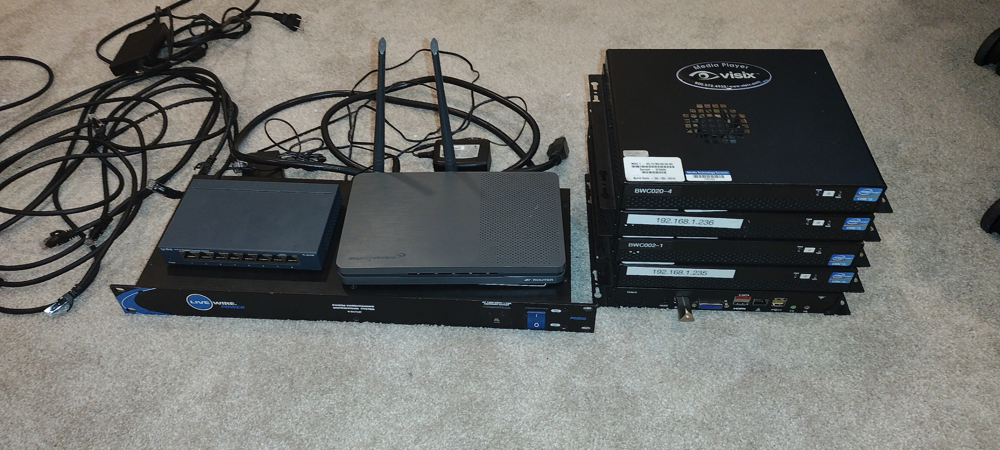
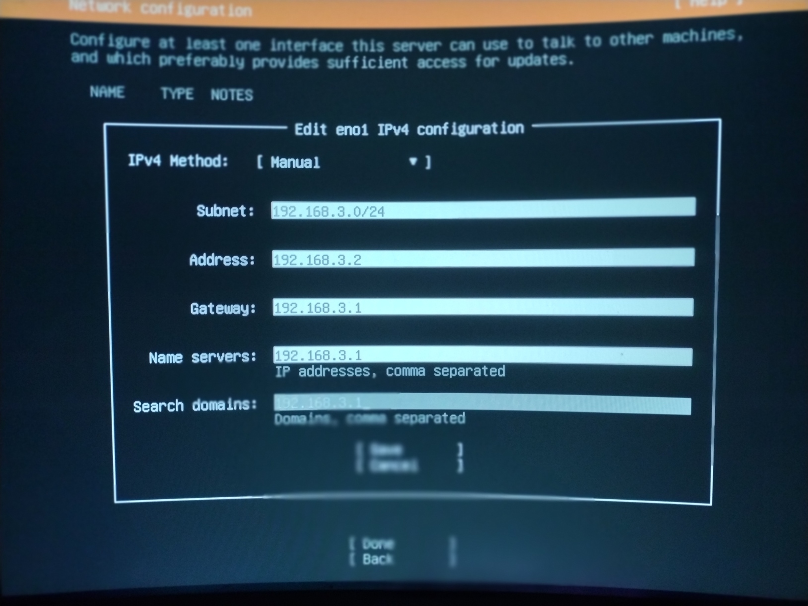
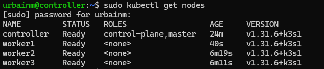
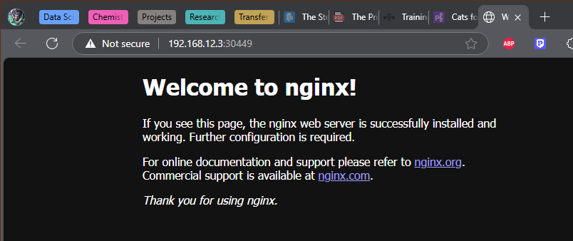

# Intro

I will be setting up a low-spec local cloud (edge) cluster with persistent storage on some 2012 audio/visual mini PCs I picked up at a school auction. 

When starting off with edge computing, it is easiest when all the computers match, but the goal is to eventually plug any computer into our junkheap and add its compute to the pool. Then it becomes a matter of weighing power consumption vs. processing efficiency to determine if adding a `node` is worth the effort.

One of our nodes will be the papa bear (control plane node) and the rest will be the baby bears (worker nodes).  
*Don’t worry about what they were called before.*

It is a good idea to eventually set up a redundant control plane node, but for now this is unnecessary.

> **Note:** Expect barricades. Things will not work, and you will have to fix them.

For me, it was confronting my networking weaknesses. I learned to delegate most DNS resolving to the access point and set the controller as the secondary DNS controller after load balancing. It’s a process, but once it’s done, you will have access to cloud-native apps utilizing S3 Object Storage without even having to sign up for an AWS account.

---

# Preparing Your Network

Start by setting up a router as an **access point** to your network.  
Make space in your router’s DHCP assignments for your nodes.

- Example subnet:  
  `192.168.12.0/24` → meaning `192.168.12.1` through `192.168.12.254` are allocated.

My nodes don’t have WiFi, so they are all wired through a switch.
 

---

# Flashing Ubuntu Server onto Each Node

Download the Ubuntu Server installation and mount it onto a USB drive.

 

I have created a space on my desk for flashing each device (the first time I did this all on the floor, cables everywhere):  

Steps:

1. Boot from USB.
2. Follow installation until you reach the **Network Connection** step.
    - Set a **static IP** (e.g., `192.168.12.2` for the controller).
    - Verify you are connected, then continue.
3. •	For allocating hard-drive space: reformat the drive and create 3 partitions: one for /boot/efi will be created automatically about 1.1gb, one mounted a /, your choice of size, but for our persistent storage create a partition unmounted which will be uniform size for all workers.  All nodes will eventually share this persistent storage as if it were one drive, it’s very cool.
4. Check the box to install **OpenSSH**.
5. Check the box to install **Docker** (choose the latest stable release).
6. Complete installation, power off, unplug keyboard/monitor, and move to the next node.

---

# SSH and Basic Setup

Great job.  Now we will attempt to SSH into our machines from a comfortable machine on the same network.  Type “ssh user@ip.add.ress.#” and if it works you will be asked for your password.  

I have logged into each node simultaneously, and will start by upgrading each node with:

```bash
sudo apt update && sudo apt upgrade -y
```

After each is upgraded I will disable swap on the drives:

```bash
sudo swapoff -a
echo 'vm.swappiness=0' | sudo tee -a /etc/sysctl.conf
```
---
# Kubernetes

My Kubernetes of choice is k3s, which is more lightweight than k8s, but this means I will have to use Rancher to lasso my nodes.  I also get to pretend I’m a cowboy Yeehaw.
Install k3s on your control-plane node first, this is a binary which will just spin up and override the hypervisor in 3 seconds:

```bash
curl -sfL https://get.k3s.io | sh -s
```

Save the output of this to a file labeled “k3s token:” so each worker is installed to the controller:
```bash
sudo cat /var/lib/rancher/k3s/server/node-token
```
Now in the same file simplify your command by replacing the ip and token in this and save again for ease:

```bash
curl -sfL https://get.k3s.io | K3S_URL="https://<PAPABEAR_IP>:6443" K3S_TOKEN="<NODE_TOKEN>" sh –
```
Now you can paste that command into each worker.

 

Well, well, well.  Would you look at that.
Let’s run a test pod in Docker to get started on load-balancing our nodes.  From now on you will only be working with the control-plane unless you need to resolve networking issues / port forwarding / you may become well acquainted with /etc/resolve.conf.

```bash
kubectl run test --image=nginx
kubectl get pods -o wide
```

PapaBear has delegated this task to worker1, it is pulling the image, and containerizing it, and then eventually running the pod which we will connect to by exposing a port:

```bash
kubectl expose pod test --type=NodePort --port=80
kubectl get svc test -o wide
```

Take note of the TCP port after 80
Connect to that port in your browser: http://ip.add.ress.#:<port> and you will see the app being hosted by the delegated worker.

 

From here out you’re free to play with whatever cloud apps you can and explore the metadata of Kubernetes systems.
Part 2 will detail how to set up Raid 5 Persistent S3 Object Storage on the spare hard-drive partition.

