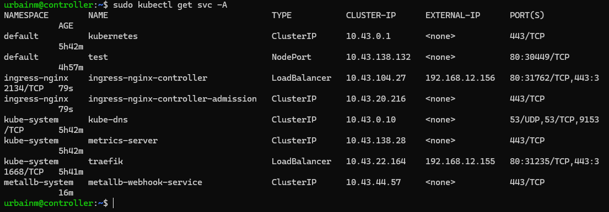
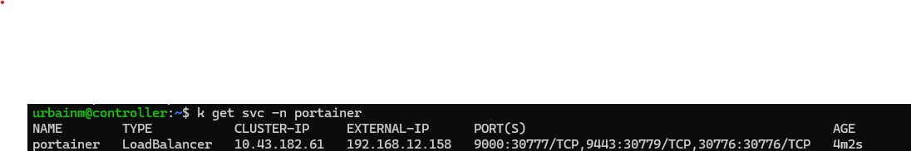
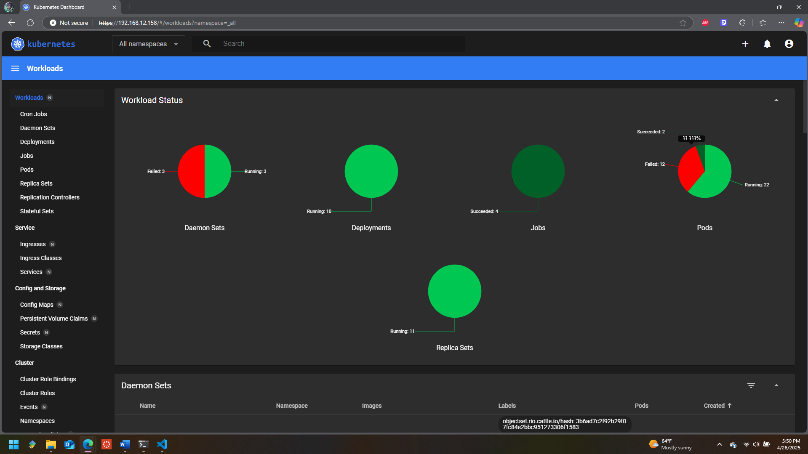
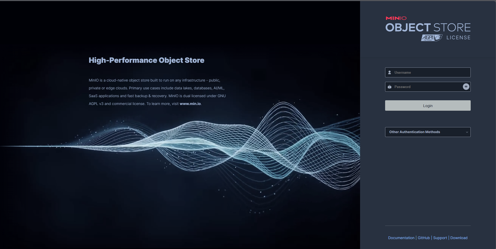

# Introduction

Now I will show you what nobody else ever does\: how to configure persistent storage.

Picking up where we left off, we will configure MetalLB Load Balancer.

```bash
kubectl apply -f https://raw.githubusercontent.com/metallb/metallb/main/config/manifests/metallb-native.yaml
```

```bash
kubectl get svc -A
```


Returns services for all namespaces

MetalLB needs some space to stretch, so we will take 100 of our allotted IP addresses from the end of our subspace (`ip.add.ress.155-254`).

This is our first encounter with .yaml. I just use nano to edit.


Save as metallb-config.yaml (Ctrl-O, Ctrl-X) and then run\\:

```bash
kubectl apply -f metallb-config.yaml
```

Our nodes’ traffic is now balanced and we can hope to have open external IP ports for our ingress controller on demand.

So, we will configure nginx (I’ve heard it’s pronounced engine X, but to me it will always be N Ginks).

```bash
kubectl apply -f https://raw.githubusercontent.com/kubernetes/ingress-nginx/main/deploy/static/provider/cloud/deploy.yaml
```

As you can see, the kubectl apply command is very versatile. It’s grabbing a .yaml off of GitHub and checking off a manifest, just a default, barebones setup. Then we are adjusting the config, and it rebuilds itself.

Here I will have to troubleshoot an issue which is the nginx Ingress giving me a 404 error.

Okay, that very simple problem only took 10 hours to solve. It came down to rewriting each .yaml line by line, but now load balancer will automatically assign an IP address to each deployed app which can be accessed by any computer on the same network.

The pod is handled by the service, which goes to the ingress, but MetalLB decides which worker actually gets the pod if that makes sense. I can also take advantage of thousands of ports per IP address, but that will be down the road. I used to hold a port open for each app by SSH tunneling. 🤦
https://nginx.org/en/docs/

---

# Setting Up a GUI

I will get to the persistent storage soon, I promise. First, I would like a GUI to monitor my nodes. I haven’t tried Portainer yet, so let’s do that.

```bash
k apply -f https://downloads.portainer.io/ce2-18/portainer.yaml
```

I’ve shortened sudo kubectl to k. This creates a namespace for Portainer with the basic skeleton again.

```bash
k patch svc portainer -n portainer --type='json' -p '[{"op":"replace","path":"/spec/type","value":"LoadBalancer"}]'
```



Good, it was assigned to the next IP after our last pod. MetalLB is working.

Things are moving fast now. I tried Portainer briefly and hated it, so what you do is delete the entire namespace for Portainer and it’s gone. No more uninstallers. Kubernetes removes most of the garbage for you.

We’ll just continue with standard Kubernetes Dashboard.



---

# Setting Up MinIO Persistent Storage

We are going to turn these stateless machines into stateful machines.

We will use MinIO and RAID 5.

If you don’t know what RAID 5 is, wrap your mind around this\: We have 4 hard drives. These 4 drives are going to store around 200GB of data shared equally. What if one of the drives fails? We still have access to all the data. How? Parity. The missing data is reconstructed. Amazing. Anyways.

We just need to make sure we have ext4 partitions which are the exact same size. For some reason I mounted these partitions to /home and that made things more complicated, but using fdisk, parted, and the --lazy unmount option I now have 4 matching 86GB partitions.

I am going to mount these partitions to /minio. It just helps my mind instead of repeating /dev/sda3 over and over.

```bash
sudo mkdir -p /mnt/minio
sudo mount /dev/sda3 /mnt/minio
```

Add the following to '/etc/fstab'\:

```bash
/dev/sda3 /mnt/minio ext4 defaults 0 2
```

This ensures your drives are mounted at boot.

---

Now that our drives are ready for RAID, we aren’t going to use the built-in RAID manager; we will use MinIO for everything disk-related.

Install MinIO on each machine

```bash
wget https://dl.min.io/server/minio/release/linux-amd64/minio
chmod +x minio
sudo mv minio /usr/local/bin/
```
Set up a folder in /etc and make minio-user the owner

```bash
sudo useradd -r minio-user -s /sbin/nologin
sudo mkdir -p /etc/minio
sudo chown minio-user:minio-user /etc/minio
```

Each worker must be broadcasting their mounted partition to port \:9000. Most of the properties to change this will be in /etc/systemd/system/minio.service.

My 2-year-old was playing with the on-off switch for the power supply, so let’s fix what broke.

It wasn’t that bad. Some of the nodes reverted to an "emergency" state which replaced their static IP addresses with random ones and disabled SSH, so they had to be accessed directly. Definitely not as bad as the last time this exact thing happened and corrupted every hard drive.

# Exposing MinIO to the load balancer

Create a minio-service.yaml on the controller

```bash
apiVersion: v1
kind: Service
metadata:
  name: minio
  namespace: default
spec:
  selector:
    app: minio
  ports:
    - protocol: TCP
      port: 9000
      targetPort: 9000
```

Save and apply

```bash
kubectl apply -f minio-service.yaml
```
Create the minio-ingress.yaml

```bash
apiVersion: networking.k8s.io/v1
kind: Ingress
metadata:
  name: minio-ingress
  namespace: default
  annotations:
    nginx.ingress.kubernetes.io/backend-protocol: "HTTP"
spec:
  rules:
  - host: minio.local
    http:
      paths:
      - path: /
        pathType: Prefix
        backend:
          service:
            name: minio
            port:
              number: 9000
```

Now access the controller from your network on port 9000.




We now have persistent distributed AWS S3 Object storage for our system.

Thank you for reading. Remember, it’s not as easy as following the instructions; there will be roadblocks, and you will have to travel down detours.
